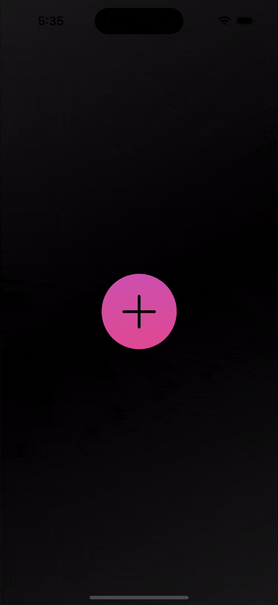
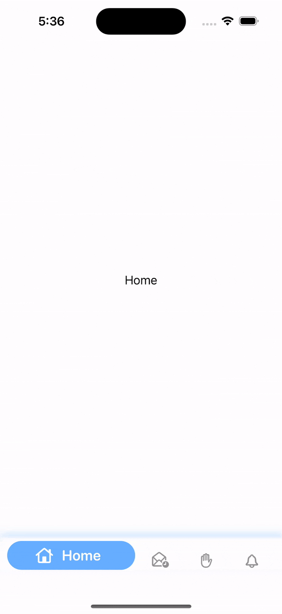
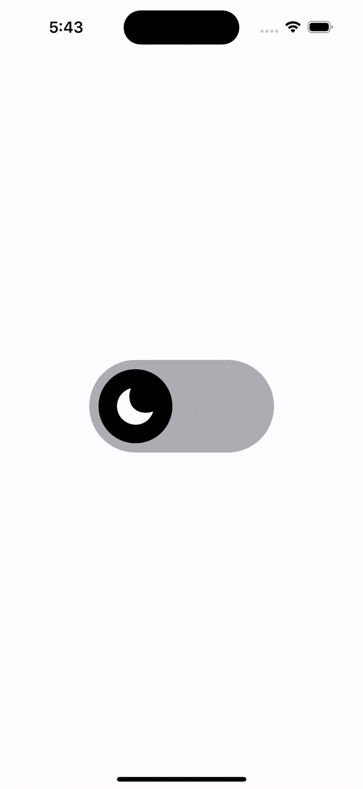
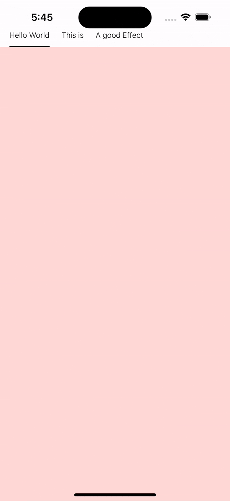

# ViewAnimations

# [AnimatedTagsTest](https://github.com/samgusa/ViewAnimations/tree/main/AnimatedTagsTest)

credit: [Kavsoft](https://www.youtube.com/watch?v=FzL11vRhzs8)

# [FigitTest](https://github.com/samgusa/ViewAnimations/tree/main/FigitTest)

credit: [https://github.com/Kushalbhavsar/FidgetText](https://github.com/Kushalbhavsar/FidgetText)

# [GooeyTest](https://github.com/samgusa/ViewAnimations/tree/main/GooeyTest)

credit: [Kavsoft](https://www.youtube.com/watch?v=jWvNdSetIXo&t=19s)

# [LiquidButton](https://github.com/samgusa/ViewAnimations/tree/main/LiquidButtonTest)

credit: [https://github.com/Kushalbhavsar/Liquid-Menu-Buttons/tree/main](https://github.com/Kushalbhavsar/Liquid-Menu-Buttons/tree/main)

## [ParallaxCarouselTest](https://github.com/samgusa/ViewAnimations/tree/main/ParallaxCarouselTest)

credit: [Kavsoft](https://www.youtube.com/watch?v=3zBSgXoSugU&t=13s)

# [TabbarTest](https://github.com/samgusa/ViewAnimations/tree/main/TabBarTest)

  
  &nbsp;&nbsp;&nbsp;
  
  &nbsp;&nbsp;&nbsp;
  

credit: [Kavsoft](https://www.youtube.com/watch?v=Lw-vimpu6Cs&t=3s)

credit: [Kavsoft](https://www.youtube.com/watch?v=Lw-vimpu6Cs&t=3s)

credit: [Kavsoft](https://www.youtube.com/watch?v=XZuc8WnZIS4&t=2s)

credit: [https://github.com/pratikg29/CustomTabBar](https://github.com/pratikg29/CustomTabBar)

# [ToggleTest](https://github.com/samgusa/ViewAnimations/tree/main/UnderlineTabBarTest)

credit: [https://github.com/ordinaryindustries/rubber-band-toggle/tree/main](https://github.com/ordinaryindustries/rubber-band-toggle/tree/main)

# [UnderlineTabBar](https://github.com/samgusa/FunAnimations/tree/main/UnderlineTabBarTest)

credit: [https://medium.com/@Archetapp/creating-an-animated-tab-bar-3cef48b9e8ed](https://medium.com/@Archetapp/creating-an-animated-tab-bar-3cef48b9e8ed)
